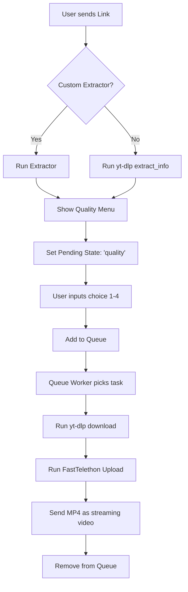

# Bot Architecture and Operation Flow Documentation

This document describes the internal architecture, database design, state machine, and data flow of the Telegram Video Downloader Userbot. It is formatted to be easily parsed by LLMs to brainstorm code improvements and architectural enhancements.

---

## 1. Overview & Technology Stack

The bot operates as a **Telegram Userbot** (acting on behalf of a user account rather than a bot account) to bypass certain Telegram constraints, such as sending larger media files and accessing private chats.

- **Telegram Library**: `Telethon` (asyncio-based client framework).
- **Fast Uploads**: `FastTelethon` (custom parallelized TCP chunk-upload script, increasing speeds to 10–20 MB/s).
- **Downloader Engine**: `yt-dlp` (Python API wrapper and CLI process executor).
- **External Downloader**: `aria2c` (used selectively for high-speed direct HTTP/FTP downloads).
- **Web Extractors**: `Playwright` (headless Chromium to bypass Cloudflare protection on specific Italian streaming sites) + regex-based HTML parsers for lightweight extractions (e.g., `HentaiWorld`).

---

## 2. Directory and File Structure

```text
├── bot/
│   ├── extractors/            # Custom stream parsers
│   │   ├── __init__.py        # Extractor registry and environment checking
│   │   ├── base.py            # Base abstract classes (BaseExtractor, PlaywrightVideoExtractor)
│   │   ├── altadefinizione.py # Playwright extractor for Altadefinizione
│   │   ├── streamingcommunity.py # Playwright extractor for StreamingCommunity
│   │   └── hentaiworld.py     # Regex-based HTML extractor for HentaiWorld
│   ├── client.py              # Telethon client factory with cross-OS session isolation
│   ├── downloader.py          # yt-dlp parameters, aria2/native protocol mapping, cookie helper
│   ├── fasttelethon.py        # Parallel TCP chunk upload logic
│   ├── handlers.py            # Message flow handlers, queues, menus, and state machine
│   ├── history.py             # Completed download history tracker (JSON)
│   ├── logging_config.py      # Console and file logger system
│   ├── queue.py               # Persistent FIFO task queue (JSON)
│   └── whitelist.py           # Whitelisted users gatekeeper (JSON)
├── data/                      # Persisted local JSON databases & session files
├── tests/                     # Pytest suite (90 test cases verifying flow, downloader, queues)
├── run.py                     # Entry point (bootstraps env, logs, checks deps, spawns listeners)
└── .env                       # Environment configuration file
```

---

## 3. Core Architectural Components

### A. Persistent Queue (`bot/queue.py`)
- **Storage**: Saved in `data/queue.json`. Writes are **atomic** (uses `tempfile.NamedTemporaryFile` + `os.replace` to prevent corruption if the system crashes mid-write).
- **Crash-Safety**: Uses a `peek()` + `remove(url)` pattern instead of `pop()`. When the queue worker starts a task, the item is kept in `queue.json` while downloading. It is only deleted *after* the file is fully uploaded to Telegram. If the bot crashes, the queue item remains and `yt-dlp` resumes the download from `.part` files on startup.
- **Methods**: `add()`, `peek()`, `remove()`, `move_front()`, `clear()`.

### B. Download History Tracker (`bot/history.py`)
- **Storage**: Saved in `data/download_history.json` (atomic writes).
- **States**: Tracks URLs mapped to their status (`ok` or `error`), saving metadata (`title`, `filepath`, `error_msg`, `timestamp`).
- **Self-Healing**:
  - `purge_resolved_errors()`: Clears out error logs that correspond to known bugs already fixed in recent releases.
  - `clear_orphan_entries()`: Periodically cleans up history records of successful downloads if the downloaded file has been manually deleted from the disk.

### C. Whitelist (`bot/whitelist.py`)
- **Storage**: Saved in `data/whitelist.json`.
- **Purpose**: Authenticates sender IDs. Only whitelisted users can send download links or interact with menus, protecting the bot from unauthorized API abuse.

### D. Extractor Registry (`bot/extractors/`)
- When a link is received, the bot checks the registry `get_extractor(url)`.
- If a custom extractor matches the domain:
  - **Playwright Extractors** (e.g., `StreamingCommunity`): Spin up headless Chromium, solve Cloudflare, capture requests for `.m3u8` streams, intercept the token, and return the stream URL + custom anti-leech headers (Referer, User-Agent, Sec-Fetch).
  - **Native/Regex Extractors** (e.g., `HentaiWorld`): Send a simple HTTP request, scan the raw HTML with regex for Javascript variables (`videoUrl`), and return the direct stream instantly without the overhead of Chromium.
- If no custom extractor matches, the bot falls back directly to `yt-dlp`'s built-in extractors.

### E. Downloader Configuration & Protocol Mapping (`bot/downloader.py`)
- Maps extraction and download tasks based on stream protocols:
  - **Direct HTTP/FTP**: Routed to the high-speed external downloader `aria2c`.
  - **HLS/DASH (m3u8, mpd)**: Routed to `yt-dlp`'s **native fragment downloader** to avoid encryption issues, using native concurrent fragment requests (configured via `CONCURRENT_FRAGMENTS` in `.env`).
- Environment parameters like `FORCE_IPV4=true` (bypasses YouTube IPv6 rate-limit blocks) and custom cookie file parsing are processed here.

---

## 4. Operation Flow & State Machine

The interaction flow is event-driven. The user triggers events, and the bot maintains a per-user `_pending` state dictionary.



### Detailed State Transitions (`bot/handlers.py`)

1. **New Link Processing (`_process_link`)**:
   - The bot replies with `🔍 Analisi del link in attesa...`
   - Spans a global async lock `_extract_lock` to serialize metadata extraction. Only one extraction process can run at a time to prevent IP/API ban rate-limiting (403 errors).
   - Once extraction is complete:
     - If it's a **single video**, sends the **Quality Menu** (1: 360p, 2: 720p, 3: 1080p, 4: MAX) and sets pending state to `{"type": "quality", "url": url, ...}`.
     - If it's a **playlist**, sends the **Playlist Menu** (paginated, 10 items per page with `next`/`prev` commands) and sets pending state to `{"type": "playlist", "videos": [...], "page": 0}`.
     - If it was **already downloaded** (checked in history) and the file is still present, asks whether to re-upload it (`si`/`no`). Sets pending state to `{"type": "confirm_retry", "action": "reupload"}`.

2. **Selection Handling (`_handle_selection`)**:
   - Matches the user's message against the active `_pending` state:
     - **If 'quality' state**: Validates input `1`–`4`, adds the item to the queue via `queue.add(...)`, replies with its position in the queue, and clears the pending state.
     - **If 'playlist' state**: Captures the index of the selected video, extracts its URL, shows the Quality Menu for that sub-video, and updates the pending state to `quality`.
     - **If 'confirm_retry' state**:
       - `si` -> Proceeds to either re-upload the cached file or re-download the link.
       - `no` -> Clears pending state and cancels the operation.

3. **Queue Processing Loop (`_queue_worker`)**:
   - Periodically polls the queue: `item = queue.peek()`.
   - Sends `⏳ Avvio download...` to the user.
   - Invokes `download_and_upload()`:
     - Downloads via `yt-dlp` (throttled logger prints progress updates to console/file every 5 seconds; edits Telegram status message every 3 seconds to avoid FloodWait limits).
     - Validates that file size is under Telegram's 2GB limit.
     - Runs `probe_video_metadata` via `ffprobe` to extract `width`, `height`, and `duration` (enables Telegram to generate a thumbnail and support native streaming playbacks).
     - Uploads the file using `FastTelethon` parallel TCP chunks.
     - Sends the video to the target channel.
     - Clears the file from disk and deletes it from the queue file.

---

## 5. Key System Optimizations Implemented

- **Session Isolation for Shared Mounts**: Setting `SESSION_PATH=/home/ersi/my_video_downloader_bot.session` in `.env` moves the sqlite session out of Samba/shared paths. The client factory detects Windows vs. Linux path formatting (`\` vs `/`) based on OS, preventing cross-platform file locking conflicts.
- **OpenSSL Bypass for Termux/Linux**: Inside `run.py`, if the platform is POSIX, the code programmatically injects `os.environ["OPENSSL_CONF"] = "/dev/null"`. This resolves broken OpenSSL configs on Termux that cause external JS engines (e.g. Node) to crash during Pornhub challenge extraction.
- **Anti-Spam Extraction Lock**: A global `asyncio.Lock()` enforces a single concurrent `extract_info` process, preventing temporary IP rate-limit bans (HTTP 403) from websites when multiple URLs are sent in rapid succession.

---

## 6. Suggested Areas for AI-Driven Improvements

When feeding this documentation to another AI, consider asking for suggestions on the following architectural points:

1. **Downloader Engine Decoupling**:
   - *Current*: `yt-dlp` runs in an executor blocking thread.
   - *Question*: How can we run `yt-dlp` fully asynchronously as a subprocess with real-time `stdout` piping to implement more responsive download progress reporting?
2. **Media Converter Pipeline**:
   - *Current*: Files over 2GB fail because Telegram user accounts have a strict 2GB limit (4GB is Premium-only).
   - *Question*: How can we implement an automatic ffmpeg segmenting utility that splits videos larger than 2GB into sequential parts (Part 1, Part 2) with shared metadata?
3. **Multi-User Queue Management**:
   - *Current*: The FIFO queue is global and single-threaded. One user downloading a large 1.9GB file blocks all other whitelisted users from downloading small 10MB videos.
   - *Question*: How can we modify the queue worker to process tasks concurrently using multiple worker threads/tasks, or implement a round-robin scheduling algorithm per user ID?
4. **Enhanced Diagnostics**:
   - *Current*: Network issues or broken extractor logs are only visible via SSH tailing `/data/bot.log`.
   - *Question*: How can we build an interactive admin dashboard directly inside Telegram (using custom command replies or inline buttons) to monitor active downloads, view server CPU/RAM usage, and clear specific queue items?
